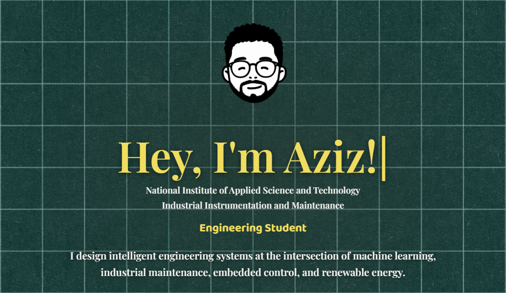

# Hey there!  I'm Aziz Moualhi   **Instrumentation & Industrial Maintenance Engineering Student**  Building intelligent systems where **AI meets Engineering**  ---  
## 💡 About Me  I design intelligent engineering systems at the intersection of **Machine Learning**, **Industrial Maintenance**, **Embedded Control**, and **Renewable Energy**.  I love taking ideas from a sketchbook to a working prototype—whether that's training an AI model, programming an ESP32, designing a mechanical assembly, or developing a modern web application.  When I'm not engineering something, you'll probably find me:  🎨 Creating digital art & UI designs 🏋️ Lifting weights and pushing my limits 🎮 Gaming and exploring immersive worlds 📚 Learning new technologies just for the fun of it  ---  
## 🚀 Currently Exploring  🧠 Artificial Intelligence & Deep Learning 🔧 Predictive Maintenance (PHM) 📡 Embedded Systems & IoT ⚙️ Industrial Automation & Instrumentation 🌿 Renewable Energy Solutions 🌐 Full-Stack Development with Next.js  ---  
### 📫 Let's Connect!  I'm always open to collaborating on AI, robotics, embedded systems, industrial automation, renewable energy, and open-source projects.  ⭐ Thanks for stopping by—feel free to explore my repositories! 

## 🌐 Socials:
 

# 💻 Tech Stack:
                    
# 📊 GitHub Stats:
 
 

### ✍️ Random Dev Quote

---

<!-- Proudly created with GPRM ( https://gprm.itsvg.in ) -->
